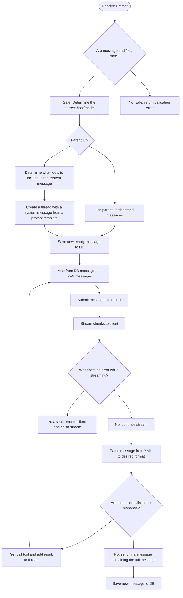

```mermaid
flowchart TD
        start(["Receive Prompt"])
        start --> safety{"Are message and files safe?"}
        safety --> determineHost["Safe, Determine the correct host/model"]
        safety --> notSafe["Not safe, return validation error"]
        hasParent --> fetchThread["Has parent, fetch thread messages"]
        determineHost --> hasParent{"Parent ID?"}
        fetchThread --> saveStartOfNewMessage["Save new empty message to DB"]
        hasParent --> determineTools["Determine what tools to include in the system message"]
        determineTools --> setSystemMessage["Create a thread with a system message from a prompt template"]
        setSystemMessage -->saveStartOfNewMessage 
        saveStartOfNewMessage --> mapMessages["Map from DB messages to P-AI messages"]
        mapMessages --> submit["Submit messages to model"]
        submit --> stream["Stream chunks to client"]
        stream --> streamErrors{"Was there an error while streaming?"}
        streamErrors --> continueStream["No, continue stream"]
        streamErrors --> sendStreamError["Yes, send error to client and finish stream"]
        continueStream --> parseMessage["Parse message from XML to desired format"]
        parseMessage --> toolCall{"Are there tool calls in the response?"}
        toolCall --> toolResult["Yes, call tool and add result to thread"]
        toolResult --> mapMessages
        toolCall --> finalize["No, send final message containing the full message"]
        finalize --> save["Save new message to DB"]
```